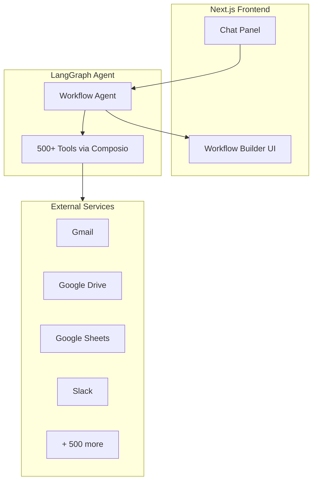
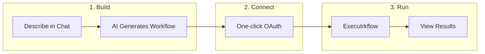

# AI Workflow Builder

Build automation workflows using natural language. Powered by LangGraph and Composio with access to **500+ tools** across Gmail, Google Drive, Slack, Notion, Zoho, and more.

---

## Table of Contents

- [Features](#features)
- [Architecture](#architecture)
- [How It Works](#how-it-works)
- [Prerequisites](#prerequisites)
- [Installation](#installation)
- [Configuration](#configuration)
- [Running the Application](#running-the-application)
- [Available Integrations](#available-integrations)


---

## Features

- **Natural Language Workflow Creation** — Describe what you want to automate in plain English
- **500+ Tool Integrations** — Access Gmail, Google Docs, Sheets, Drive, Slack, Notion, Zoho CRM, and hundreds more via Composio
- **Visual Workflow Builder** — See your workflow as connected steps, edit descriptions and instructions inlinene-Click OAuth** — Composio handles authentication automatically with OAuth flows
- **Review Before Execution** — Confirm and iterate on workflow design before running

---

## Architecture



---

## How It Works



---

## Prerequisites

Before you begin, ensure you have the following installed:

| Requirement | Version | Check Command |
|-------------|---------|---------------|
| Python | 3.10+ | `python --version` |
| Node.js | 18+ | `node --version` |
| npm | 9+ | `npm --version` |
| pip | Latest | `pip --version` |

### API Keys Required

You will need accounts and API keys from:

1. **OpenAI** — [Get API Key](https://platform.openai.com/api-keys)
2. **Composio** — [Get API Key](https://app.composio.dev)

Optional:
- **LangSmith** — For tracing and debugging ([Get API Key](https://smith.langchain.com))

---

## Installation

### 1. Clone the Repository

```bash
git clone https://github.com/foets/Workflow-builder.git
cd Workflow-builder
```

### 2. Install Backend Dependencies

```bash
cd agent
pip install -r requirements.txt
```

### 3. Install Frontend Dependencies

```bash
cd ../web
npmll
```

---

## Configuration

### Backend Configuration

1. Navigate to the agent directory:

```bash
cd agent
```

2. Copy the environment template:

```bash
cp .env.example .env
```

3. Edit .env and add your API keys:

```bash
# Required
OPENAI_API_KEY=your_openai_api_key
COMPOSIO_API_KEY=your_composio_api_key

# Optional: LangSmith tracing
LANGSMITH_API_KEY=your_langsmith_api_key
LANGSMITH_TRACING=true
LANGSMITH_PROJECT=workflow-builder
```

### Frontend Configuration

1. Navigate to the web directory:

```bash
cd web
```

2. Create .env.local:

```bash
echo "NEXT_PUBLIC_LANGGRAPH_API_URL=http://localhost:2024" > .env.local
```

---

## Running the Application

### Step 1: Start the Backend

Open a terminal and run:

```bash
cd agent
langgraph dev --no-browser
```

The agent server will start on http://localhost:2024.

### Step 2: Start the Frontend

Open a new terminal and run:

```bash
cd web
npm run dev
```

The web app will start on http://localhost:3001.

### Step 3: Open the Application

Navigate to [http://localhost:3001](http://localhost:3001) in your browser.

---

## Available Integrations

Via Composio's 500+ tool integrations:

| Category | Tools |
|----------|-------|
| Google Suite | Gmail, Docs, Sheets, Calendar, Drive |
| CRM | Zoho CRM, Zoho Bigin, HubSpot, Salesforce |
| Communication | Slack, Discord, Microsoft Teams |
| Productivity | Notion, Trello, Asana, Linear |
| Developer | GitHub, GitLab, Jira |
| And more... | 500+ tools available |

---


